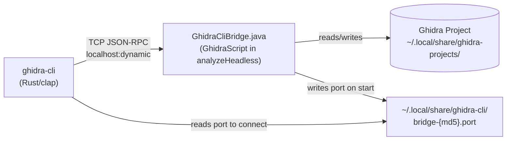

# Ghidra CLI

A high-performance Rust CLI for automating Ghidra reverse engineering tasks, designed for both direct usage and AI agent integration (like Claude Code).

## Features

- **Direct bridge architecture** - CLI connects directly to a Java bridge running inside Ghidra's JVM
- **Auto-start bridge** - Import/analyze commands automatically start the bridge
- **Fast queries** - Sub-second response times with Ghidra kept in memory
- **Comprehensive analysis** - Functions, symbols, types, strings, cross-references
- **Type system** - Create/edit structs, enums, typedefs; add/remove struct fields
- **Function signatures** - Edit return types, calling conventions, full C signatures; retype variables
- **Binary patching** - Modify bytes, NOP instructions, export patches
- **Call graphs** - Generate caller/callee graphs, export to DOT format
- **Search capabilities** - Find strings, bytes, functions, crypto patterns
- **Script execution** - Run Java/Python Ghidra scripts, inline or from files
- **Batch operations** - Execute multiple commands from a file
- **Flexible output** - Human-readable, JSON, or pretty JSON formats
- **Filtering** - Powerful expression-based filtering (e.g., `size > 100`)

## Architecture



The CLI connects directly to a Java bridge running inside Ghidra's JVM. This provides:
- **Consistent state** - Single Ghidra process for all operations
- **Fast queries** - No JVM startup overhead per command
- **Auto-start** - Bridge starts automatically when needed
- **Per-project isolation** - Each project gets its own bridge process and port file, enabling concurrent analysis of multiple binaries
- **Minimal dependencies** - Only Ghidra + Java required (no Python/PyGhidra)

## Installation

### Nix Flake (recommended)

```bash
# Run directly
nix run github:nonsleepr/ghidra-cli

# Install into profile (binary named ghidra-cli, sets GHIDRA_INSTALL_DIR automatically)
nix profile install github:nonsleepr/ghidra-cli
```

### From Source

```bash
git clone https://github.com/nonsleepr/ghidra-cli
cd ghidra-cli
cargo install --path .
```

### Requirements

- **Ghidra 12.0+** - Download from [ghidra-sre.org](https://ghidra-sre.org)
- **Java 17+** - Required by Ghidra
- **Rust 1.70+** - For building from source

Set the Ghidra installation path:
```bash
export GHIDRA_INSTALL_DIR=/path/to/ghidra
# Or configure via CLI:
ghidra-cli config set ghidra_install_dir /path/to/ghidra
```

## Quick Start

```bash
# Check installation
ghidra-cli doctor

# Import and analyze a binary (bridge auto-starts)
ghidra-cli import ./binary --project myproject --program mybinary
ghidra-cli analyze --project myproject --program mybinary

# Query functions (uses running bridge)
ghidra-cli function list

# Decompile a function
ghidra-cli decompile main

# Find interesting strings
ghidra-cli find string "password"

# Get cross-references
ghidra-cli x-ref to 0x401000

# Generate call graph
ghidra-cli graph callers main --depth 3
```

## Commands

### Project & Program Management
```bash
ghidra-cli project create <name>           # Create project
ghidra-cli project list                    # List projects
ghidra-cli project delete <name>           # Delete project
ghidra-cli import <binary> --project <p>   # Import binary (auto-starts bridge)
ghidra-cli analyze --project <p>           # Run analysis
```

### Function Analysis
```bash
ghidra-cli function list                   # List all functions
ghidra-cli function list --filter "size > 100"  # Filter by size
ghidra-cli function calls <name>           # List calls made by function
ghidra-cli decompile <name-or-addr>        # Decompile function
ghidra-cli decompile main --with-vars --with-params  # Include variable/param details
ghidra-cli disasm <address> --instructions 20  # Disassemble instructions
ghidra-cli function set-signature <func> --signature "int foo(int x, char *y)"
ghidra-cli function set-return-type <func> --type void
ghidra-cli function set-calling-convention <func> --convention __cdecl
ghidra-cli function set-var-type <func> --var local_10 --type "MyStruct *"
```

### Symbols & Types
```bash
ghidra-cli symbol list                     # List symbols
ghidra-cli symbol create <addr> <name>     # Create symbol
ghidra-cli symbol rename <old> <new>       # Rename symbol
ghidra-cli type list                       # List data types (with kind: struct/enum/typedef/...)
ghidra-cli type get <name>                 # Get type details (fields, enum members, typedef base)
ghidra-cli type create <name>              # Create empty struct
ghidra-cli type add-field <struct> --name fd --type int   # Add struct field
ghidra-cli type del-field <struct> --name fd              # Remove struct field
ghidra-cli type create-enum <name> --values "A=0,B=1"     # Create enum
ghidra-cli type typedef <name> <base_type>                # Create typedef alias
ghidra-cli type rename <old> <new>         # Rename type
ghidra-cli type delete <name>              # Delete type
```

### Cross-References
```bash
ghidra-cli x-ref to <address>              # References TO address
ghidra-cli x-ref from <address>            # References FROM address
```

### Search
```bash
ghidra-cli find string "pattern"           # Find strings
ghidra-cli strings list                    # List all defined strings
ghidra-cli strings refs "pattern"          # Show xrefs to strings matching pattern
ghidra-cli find bytes "90 90 90"           # Find byte patterns
ghidra-cli find function "*crypt*"         # Find functions by name
ghidra-cli find crypto                     # Find crypto constants
ghidra-cli find interesting                # Find interesting patterns
```

### Call Graphs
```bash
ghidra-cli graph calls                     # Full call graph
ghidra-cli graph callers <func>            # Who calls this? (--depth optional)
ghidra-cli graph callees <func>            # What does this call? (--depth optional)
ghidra-cli graph export dot                # Export to DOT format
```

### Binary Patching
```bash
ghidra-cli patch bytes <addr> "90 90"      # Patch bytes
ghidra-cli patch nop <addr> --count 5      # NOP out instructions
ghidra-cli patch export -o patched.bin     # Export patched binary
```

### Comments
```bash
ghidra-cli comment get <address>           # Get comment at address
ghidra-cli comment set <addr> "note" --comment-type EOL  # Set comment (types: EOL, PRE, POST, PLATE)
ghidra-cli comment delete <address>        # Delete comment
ghidra-cli comment list                    # List all comments (no default limit; use --limit N to cap)
```

### Scripts
```bash
ghidra-cli script list                     # List available scripts
ghidra-cli script run myscript.py          # Run script file
ghidra-cli script python "print(currentProgram)"  # Inline Python
```

### Batch Operations
```bash
ghidra-cli batch commands.txt              # Run commands from file
```

### Statistics
```bash
ghidra-cli stats                           # Program statistics
ghidra-cli summary                         # Program summary
```

## Bridge Management

The bridge keeps Ghidra loaded in memory. It starts automatically when needed, but you can also control it manually:

```bash
# Start bridge with a program loaded
ghidra-cli start --project myproject --program mybinary

# Check bridge status
ghidra-cli status --project myproject

# All commands use the bridge automatically
ghidra-cli function list --project myproject    # Fast!
ghidra-cli decompile main --project myproject   # Fast!

# Stop bridge
ghidra-cli stop --project myproject

# Restart with different program
ghidra-cli restart --project myproject --program otherbinary
```

### Multi-Project Support

Each project gets its own bridge process and port file, allowing concurrent analysis:

```bash
# Work on multiple projects simultaneously
ghidra-cli import ./binary_a --project projA
ghidra-cli analyze --project projA --program binary_a
ghidra-cli import ./binary_b --project projB
ghidra-cli analyze --project projB --program binary_b

# Query each independently
ghidra-cli function list --project projA
ghidra-cli function list --project projB
```

## Output Formats

Default output is human-readable when connected to a terminal. When piped (non-TTY), output auto-detects to compact JSON for machine consumption. Use flags to override:

- **Default (TTY)**: Compact human-readable format (designed for both humans and AI agents)
- **Default (pipe)**: Compact JSON for machine parsing
- **--json**: Compact JSON for machine parsing
- **--pretty**: Pretty-printed JSON (indented, multi-line)

Override with flags:
```bash
# Force JSON output (compact, single-line)
ghidra-cli function list --json

# Force pretty JSON (indented, multi-line)
ghidra-cli function list --pretty

# Select specific fields
ghidra-cli function list --fields "name,address,size"
```

### Output Format Design

Format detection occurs at the CLI boundary. The bridge always returns compact JSON for IPC efficiency. The CLI applies format transformation (human-readable, pretty JSON) at the output boundary based on TTY detection or explicit flags. This design maintains a stable IPC protocol with a single format decision point.

## Filtering

Use expressions to filter results:

```bash
ghidra-cli function list --filter "size > 100"
ghidra-cli function list --filter "name ~ 'main'"
ghidra-cli strings list --filter "length > 20"
```

## AI Agent Integration

Ghidra CLI is designed to work seamlessly with AI coding assistants like Claude Code. The structured output and comprehensive command set make it ideal for automated reverse engineering workflows.

Example workflow with an AI agent:
1. `ghidra-cli import suspicious.exe --project analysis` + `ghidra-cli analyze --project analysis` - Import, analyze, start bridge
2. `ghidra-cli find interesting` - AI analyzes suspicious patterns
3. `ghidra-cli decompile <func>` - AI examines specific functions
4. `ghidra-cli x-ref to <addr>` - AI traces data flow
5. `ghidra-cli patch nop <addr>` - AI patches anti-debug code
6. `ghidra-cli patch export -o patched.bin` - Export patched binary

## Troubleshooting

### Common Issues

#### Missing X11 Libraries (Linux/WSL)

If you see errors like `libXtst.so.6: cannot open shared object file`, install X11 libraries:

```bash
# Arch Linux / WSL with Arch
sudo pacman -S libxtst

# Ubuntu / Debian / WSL with Ubuntu
sudo apt install libxtst6

# Fedora / RHEL
sudo dnf install libXtst
```

#### Java Version Issues

Ghidra requires JDK 17 or higher (not just JRE):

```bash
# Arch Linux
sudo pacman -S jdk21-openjdk

# Ubuntu / Debian
sudo apt install openjdk-21-jdk

# Verify installation
java -version  # Should show 17+ and include "JDK"
```

#### WSL-Specific Notes

WSL requires X11 libraries even for headless operation because Java AWT is loaded during initialization:

1. Install X11 libraries (see above)
2. If using WSL1, consider upgrading to WSL2 for better compatibility
3. Bridge port/PID files are stored in `~/.local/share/ghidra-cli/`

#### Running Doctor

Use the doctor command to verify your installation:

```bash
ghidra-cli doctor
```

This checks:
- Ghidra installation directory
- analyzeHeadless availability
- Project directory configuration
- Config file status

## Contributing

Contributions are welcome! Please feel free to submit issues and pull requests.

## License

GPL-3.0 License - See [LICENSE](LICENSE) for details.
